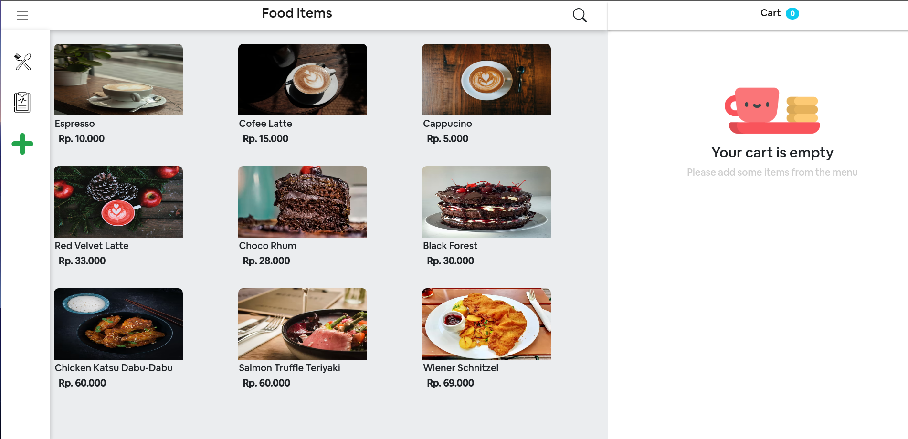
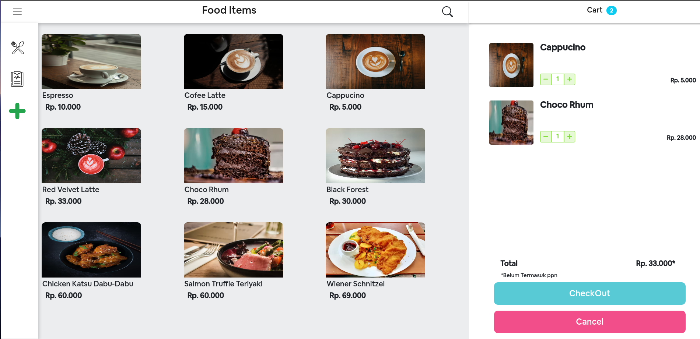
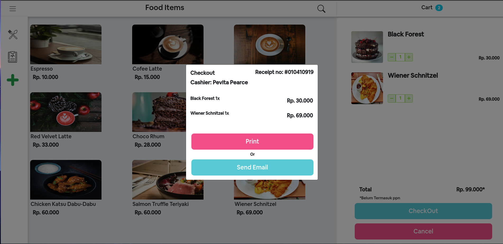
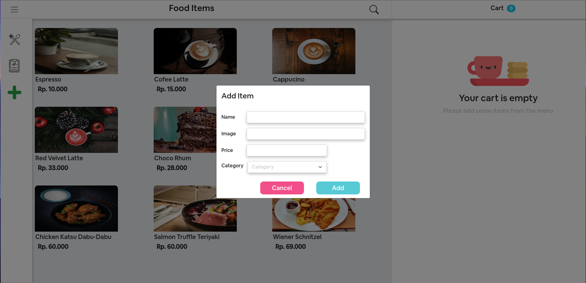
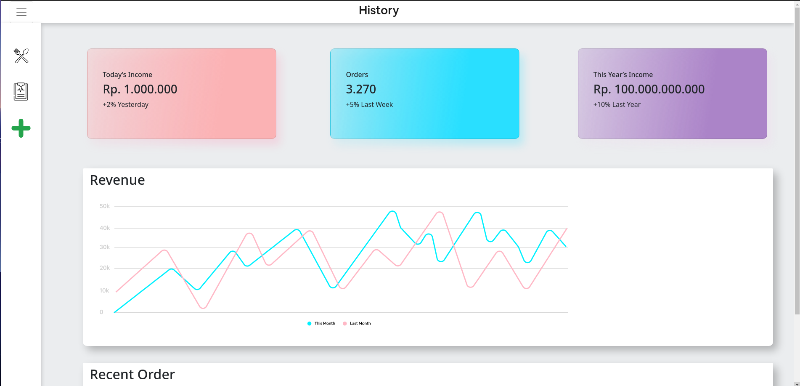

<div id="top"></div>

<!-- PROJECT LOGO -->
<br />
<div align="center">
  <a href="https://github.com/github_username/repo_name">
    
  </a>

<h3 align="center">Point Of Sale</h3>

  <p align="center">
    <a href="https://github.com/roufurrohim/frontend-with-react.git">View Demo</a>
    ·
    <a href="https://github.com/roufurrohim/frontend-with-react.git">Report Bug</a>
    ·
    <a href="https://github.com/roufurrohim/frontend-with-react.git">Request Feature</a>
  </p>
</div>


<!-- TABLE OF CONTENTS -->
<details>
  <summary>Table of Contents</summary>
  <ol>
    <li>
      <a href="#about-the-project">About The Project</a>
      <ul>
        <li><a href="#built-with">Built With</a></li>
      </ul>
    </li>
    <li>
      <a href="#getting-started">Getting Started</a>
      <ul>
        <li><a href="#getting-started">Prerequisites</a></li>
        <li><a href="#getting-started">Installation</a></li>
      </ul>
    </li>
    <li><a href="#roadmap">Roadmap</a></li>
    <li><a href="#contact">Contact</a></li>
    <li><a href="#contact">Screenshot</a></li>
  </ol>
</details>


<!-- ABOUT THE PROJECT -->
<div id="#about-the-project"></div>

## About The Project



POS is a simple point of sale web application. POS is built for fast food restaurant point of sale, but of course, it can be applied to must restaurants that have a similiar flow. It created with simplicity and robustness in mind and intended for my exploration of Javascript technologies. POS made with ReactJS and react-bootstrap.

<p align="right">(<a href="#top">back to top</a>)</p>


<div id="#built-with"></div>

### Built With

* [React.js](https://reactjs.org/)
* [React-Bootstrap](https://react-bootstrap.github.io/)
* [React-Router-Dom](https://reactrouter.com/web/guides/quick-start)
* [Bootstrap](https://getbootstrap.com)

<p align="right">(<a href="#top">back to top</a>)</p>


<!-- GETTING STARTED -->
<div id="#getting-started"></div>

## Getting Started

### Prerequisites

* npm
  ```sh
  npm install npm@latest -g
  ```

### Installation

1. Clone the repo
   ```sh
   git clone https://github.com/roufurrohim/frontend-with-react.git
   ```
2. Install NPM packages
   ```sh
   npm install
   ```
3. Start project
   ```sh
   npm start
   ```

<p align="right">(<a href="#top">back to top</a>)</p>

<div id="#roadmap"></div>

<!-- ROADMAP -->
## Roadmap

- [ ] Git clone this repository
- [ ] npm install
- [ ] Home 
- [ ] Sidebar
  - [ ] Dashboard
  - [ ] Add products
- [ ] Cart
  - [ ] Checktout


<p align="right">(<a href="#top">back to top</a>)</p>


<div id="#screenshot"></div>

## Screenshot

Below is a sample screenshot of the App Coffee Shop website and mobile display for users.

---------------------------------------------------
Display Web|Display Mobile
:-----------------------:|:----------------------------:
 | 
 | 

<p align="right">(<a href="#top">back to top</a>)</p>